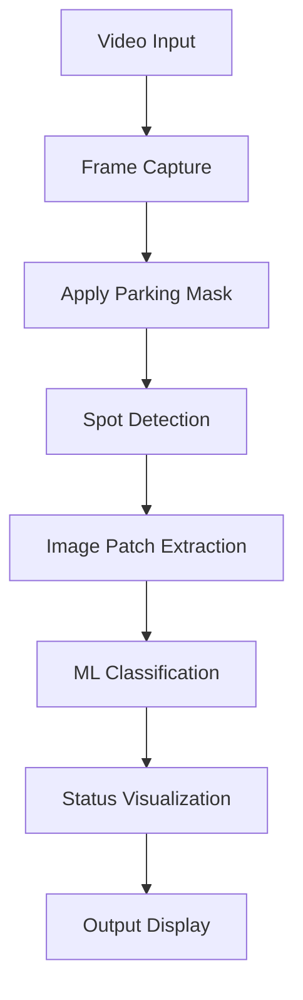

# Smart Parking Space Detection System


## Table of Contents
- [Demo](#demo)
- [Project Overview](#project-overview)
- [Key Features](#key-features)
- [Technology Stack](#technology-stack)
- [Installation](#installation)
- [Project Workflow](#project-workflow)


## Demo


## Project Overview
Real-time computer vision system that detects parking space availability using video analysis and machine learning. Classifies spots as occupied (red) or vacant (green) with visual indicators.

## Key Features
- Real-time video processing (MP4/RTSP)
- 90%+ accurate SVM classifier
- Color-coded spot status visualization
- Available spots counter
- Customizable parking layouts
- Optimized frame sampling

## Technology Stack
| Component               | Technology Used |
|-------------------------|-----------------|
| Computer Vision         | OpenCV          |
| Machine Learning        | Scikit-learn    |
| Image Processing        | scikit-image    |
| Video I/O               | FFmpeg          |

## Installation

## Commands to Setup Project on Local Machine

1. **Clone the repository:**
   ```bash
   git clone https://github.com/dyavadi8769/Smart-Parking-Space-Detection-System.git
   cd Smart-Parking-Space-Detection-System
2.  **Create a virtual environment and activate it:**
    ```bash
    conda create -p env python==3.10 -y
    conda activate env/ 
3.  **Install the Required Dependecies:**
    ```bash
    pip install -r requirements.txt
4. **Run the main.py to start counting Parking spaces :**
    ```bash
    streamlit run main.py
## Project Workflow



  
# Author:

```bash
Author: Sai Kiran Reddy Dyavadi
Role  : Data Scientist
Email : dyavadi324@gmail.com
```
